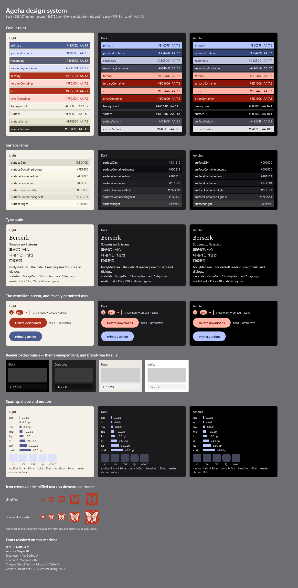
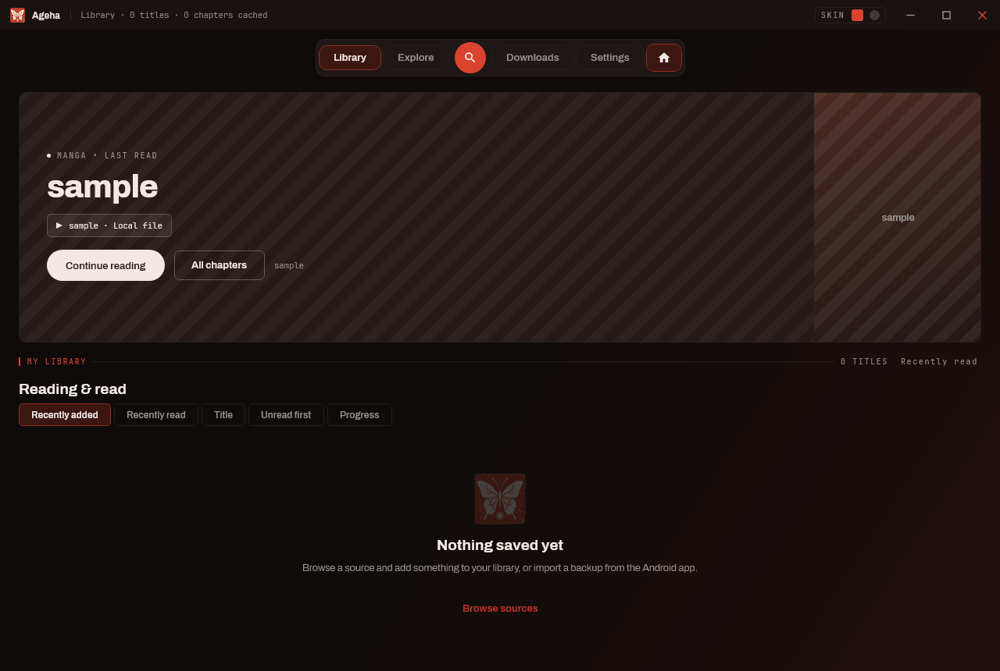
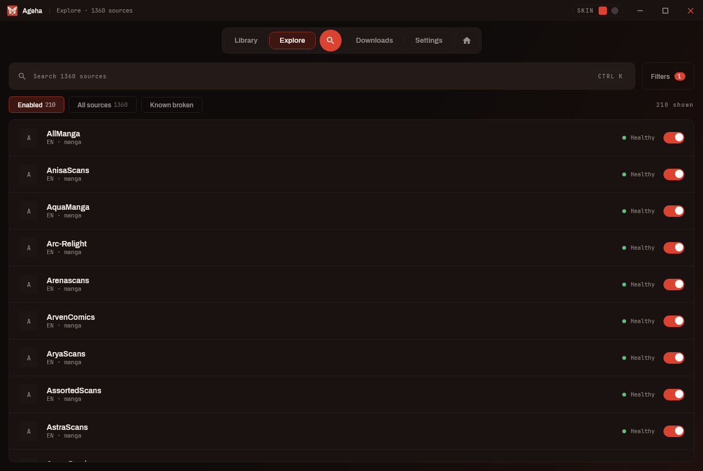
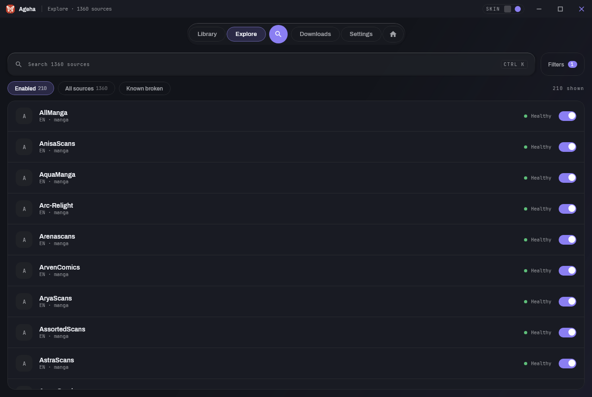
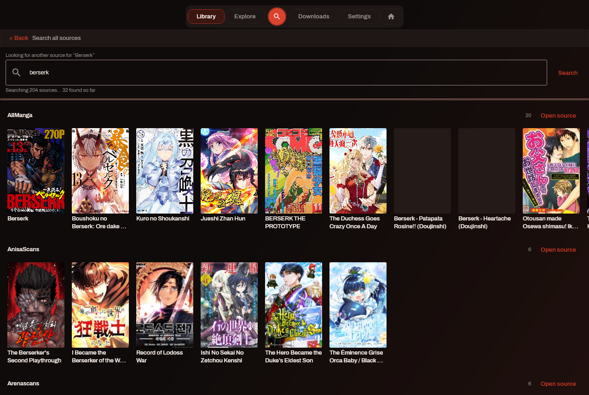
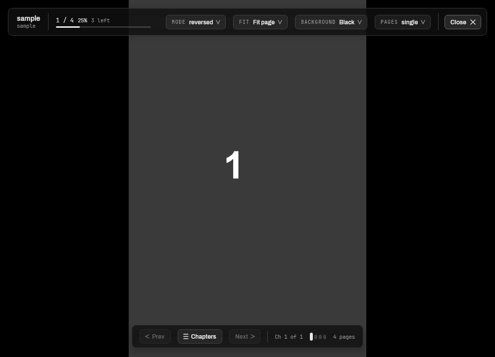
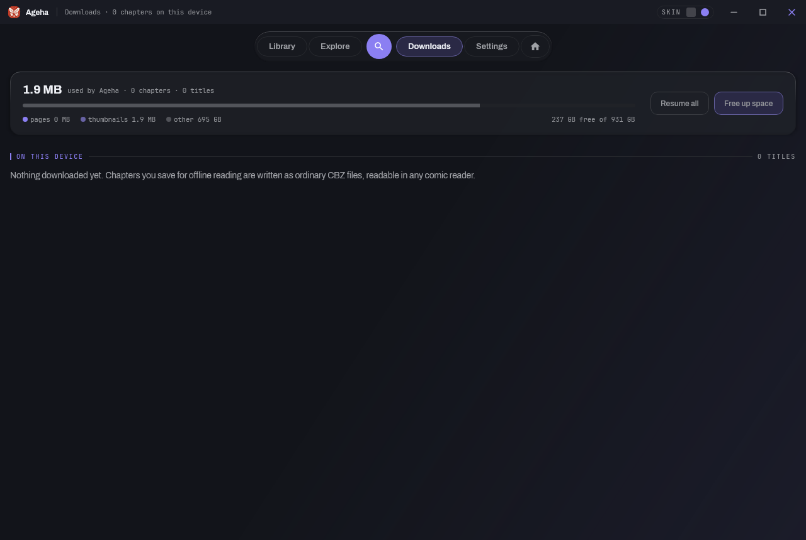

# Ageha (アゲハ)

A desktop manga reader for **Windows**. Kotlin, Compose Multiplatform, JDK 21.

Ageha is a desktop port of [Kotatsu-Redo](https://github.com/Kotatsu-Redo/Kotatsu-Redo), an Android
manga reader. It reads from the same 1360 manga sources by consuming the same parser library, so
keeping up with the web is a dependency bump rather than a rewrite.

**Status: milestone 9 of 9.** The application runs: library, source browsing, a reader, downloads,
settings and Android backup import. Tracking is the one deliverable not built — it needs OAuth
clients registered per service, which is explained in
[docs/ARCHITECTURE.md](docs/ARCHITECTURE.md) §7b.



## Screenshots

Every image below is a real render of the running application, produced by
`./gradlew :app:desktop:renderShell` -- the same headless pass CI runs on every push, driving the
real screens against the real source registry. They are regenerated rather than curated, so a
screenshot here cannot quietly drift from what the app does.

### The library

The banner answers the question the app is opened to settle -- what was I reading -- and the shelf
sits underneath it. Shown on a fresh profile, so the grid is empty.



### Two skins, one layout

Ember is flat, warm and opaque; Glass is frosted, cool and fully rounded. Same screen, same
information, switched from the title bar.





### Searching every source at once

One query, fanned out across every enabled source and grouped by where each result came from.



### The reader

Two floating pills -- position, fit, background and page mode above; chapter navigation and page
ticks below -- over a background that is always a user-chosen neutral. No brand colour touches a
page.



### Downloads

Chapters are saved as ordinary CBZ files, readable in any comic reader. The card reports what is
actually on disk rather than what was queued.



## Disclaimer

**The manga sources are nothing to do with this project or its author.**

Ageha hosts no manga, stores no manga on any server, and is not affiliated with, endorsed by, or
connected to any of the ~1360 sites it can read. It bundles none of their content. The list of
sites comes from [kotatsu-parsers-redo](https://github.com/Kotatsu-Redo/kotatsu-parsers-redo), a
separate GPL-3.0 library maintained by other people; Ageha consumes it as a dependency and does not
write, review or endorse a single parser in it. When you enable a source, your own computer talks
to that site directly, as your browser would. What is on the far end, whether reading it is lawful
where you are, and whether you should be, are your business — please support publishers and
official releases where they exist.

**Ageha is an unofficial fork.** It is a desktop port of
[Kotatsu-Redo](https://github.com/Kotatsu-Redo/Kotatsu-Redo), which is itself a fork of
[Kotatsu](https://github.com/KotatsuApp/Kotatsu), an Android manga reader. It is not affiliated
with or endorsed by the Kotatsu authors or the Kotatsu-Redo maintainers, and anything wrong with it
should be reported here rather than to either of them. Full attribution and the GPL-3.0 statement
of changes are in [NOTICE.md](NOTICE.md).

The software is provided without warranty of any kind, as GPL-3.0 sections 15 and 16 set out.

## Running it

**If you just want to use Ageha, read [docs/RUNNING.md](docs/RUNNING.md)** -- installing it, where
your library is kept, what to expect on first launch, and how to get past the unsigned-app warning.
Nothing below is needed for that.

From a checkout:

```
./gradlew :app:desktop:run                    # the application
./gradlew :app:desktop:run --args=--gallery   # the design system gallery
./gradlew :app:desktop:packageMsi             # a Windows installer
```

Both `run` and the render tools use the same profile directory the installed app does. Set
`AGEHA_DATA_DIR` to point a checkout at a scratch profile instead of the library you actually read.

## What it does

- **Library** — shelves with live counts, a grid that reflows with the window, continue-reading,
  filter and sort.
- **Explore** — all 1360 sources, enabled individually, with paged browsing and search per source.
- **Reader** — paged left-to-right and right-to-left, double-page spreads with cover-offset
  handling, continuous webtoon, zoom and pan, four fit modes, auto-hiding chrome, and full keyboard
  control. Reading position is restored exactly.
- **Downloads** — offline chapters written as ordinary CBZ, readable in any comic reader.
- **Settings** — themes, reader defaults, and the parsers update engine: check, roll back, pin.
- **Backup import and export** — the Android app's own format, both directions. Import reports
  exactly what it could not restore; export writes a file that also restores back onto a phone.
- **Sync** — reading history, favourites and categories against a
  [kotatsu-syncserver](https://github.com/KotatsuApp/kotatsu-syncserver) you run yourself, using
  the same protocol as the Android app. There is no Ageha-hosted service and no default address.

## The command line

Everything the UI does is also reachable without it, which is how the source layer is tested.

```
./gradlew :app:cli:installDist
./app/cli/build/install/cli/bin/cli sources
./app/cli/build/install/cli/bin/cli search MANGADEX "frieren"
./app/cli/build/install/cli/bin/cli smoke --sample 25   # exercise real sources end to end
./app/cli/build/install/cli/bin/cli import backup.zip   # import an Android backup
./app/cli/build/install/cli/bin/cli export              # write one, dated, to the current directory
./app/cli/build/install/cli/bin/cli sync                # sync with a kotatsu-syncserver
```

## Migrating from the Android app

Export a backup from Kotatsu-Redo and use **File → Import Android backup**, or `cli import
<backup.zip>`. Library, favourites, categories, reading history and reading positions come across;
the import says exactly what it could not restore rather than reporting success over a partial one.

It runs the other way too. **File → Export backup**, or `cli export`, writes the same format, so a
desktop library restores onto a phone as readily as it arrived from one — and, more to the point,
copies to another machine or a backup drive. Downloaded chapters are not in the archive; they are
ordinary CBZ files, and copying the folder moves them.

## Sync

Optional, off until configured, and pointed at a server you host. **Settings → Sync**, or
`cli sync login <address> <email>`. Ageha speaks the same protocol as the Android app, so a phone
and a desktop stay in step through one server; reading history, favourites and categories travel
both ways, including deletions.

Two things worth knowing before you use it. Ageha syncs at startup and when asked, **not on a
timer** — the protocol is not incremental, so a periodic sync would re-send your whole library each
time. And if you let it remember your password, that password is stored in a file in Ageha's data
folder, protected by your user account and nothing stronger: desktop has no keychain a plain JVM
can reach without shipping a native library for every platform. Declining is supported, and costs a
prompt whenever the session expires.

## Architecture in one paragraph

Manga sources are never implemented here. They come from
[kotatsu-parsers-redo](https://github.com/Kotatsu-Redo/kotatsu-parsers-redo), a library of 1360
site parsers, consumed through JitPack and loaded in an isolated classloader so a newer build can
replace it without a new version of Ageha. Ageha implements the host side of that library's
`MangaLoaderContext` and reaches it through a narrow typed bridge. No other module may import a
parser-library type, and the build fails if one tries. See
[docs/ARCHITECTURE.md](docs/ARCHITECTURE.md); the investigation behind it is in
[docs/FINDINGS.md](docs/FINDINGS.md), and the visual design in [docs/DESIGN.md](docs/DESIGN.md).

## Known limitation: JavaScript

Ageha ships a sandboxed [Rhino](https://github.com/mozilla/rhino) engine, which covers the ~257
sources that fall back to an anti-bot script. Around **20** of the 1360 need a real *browser*
engine, because the parser library's `evaluateJs` is a headless-browser contract rather than a
script-engine one — the scripts load a page, wait for the site's own JavaScript to render, and read
the resulting DOM. Those sources report a clear "needs the browser component" message with an
offer to install it, rather than failing vaguely. The other ~1340 are unaffected.

## Building

Needs JDK 21. The Gradle wrapper handles the rest.

```
./gradlew build                 # compile and test
./gradlew test                  # tests, excluding networked ones
./gradlew test -PwithNetwork    # include tests that hit live sources
./gradlew :app:desktop:renderShell   # draw the real app headlessly, without a display
```

Brand assets and colour tokens are generated, not hand-edited:

```
./gradlew :tools:brandkit:generateBrandAssets
```

## Packaging

Ageha's installer is built with **[Hydraulic Conveyor](https://www.hydraulic.dev/)**, which
produces a signed, self-updating package and the update feed beside it. Conveyor is free for
projects under an OSI-approved licence; Ageha is GPL-3.0, so it qualifies.

Ageha targets **Windows on x64 and nothing else**. Conveyor can package for macOS and Linux, and
was configured to; that was a mistake this project paid for, and the reasoning is in `CLAUDE.md`.

```
conveyor make site
```

The configuration is [conveyor.conf](conveyor.conf); the release process, including the current
lack of code signing and the routes to fixing that, is in [docs/RELEASING.md](docs/RELEASING.md).

**Releases are not code-signed.** Windows SmartScreen will warn on first run.
[docs/RUNNING.md](docs/RUNNING.md) has the click-through for a user;
[docs/RELEASING.md](docs/RELEASING.md) covers what signing would take.

Windows on ARM runs the x64 build under emulation. There is no arm64 package and there cannot be
one: no JDK vendor publishes a Windows/AArch64 21 for Conveyor to bundle.

## Keeping up with the web

Sources break weekly and the fix is almost always upstream, so this is automated. Every six hours a
workflow checks for a new parsers build, runs the full suite against it, and opens a pull request
that merges itself on green. Nightly, another exercises a random sample of real sources end to end.
[docs/UPDATING.md](docs/UPDATING.md) explains the whole thing for someone who has forgotten how it
works.

## Licence and attribution

Ageha is licensed under the **GNU General Public License v3.0**. See [LICENSE](LICENSE).

It is a derivative work of GPL-3.0 projects by the Kotatsu authors and the Kotatsu-Redo
maintainers. Attribution and a summary of changes are in [NOTICE.md](NOTICE.md), as GPL-3.0
requires.
